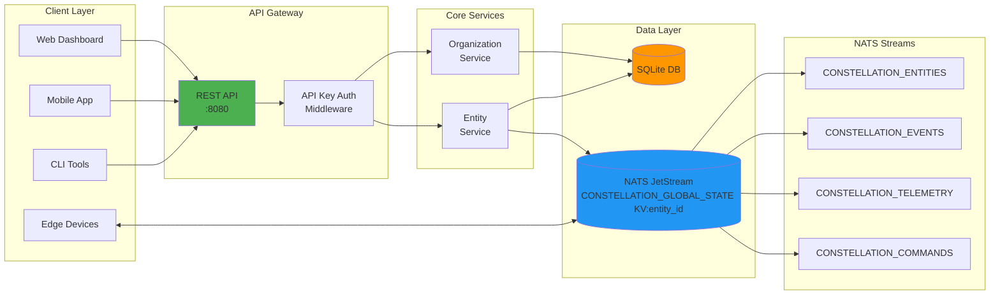
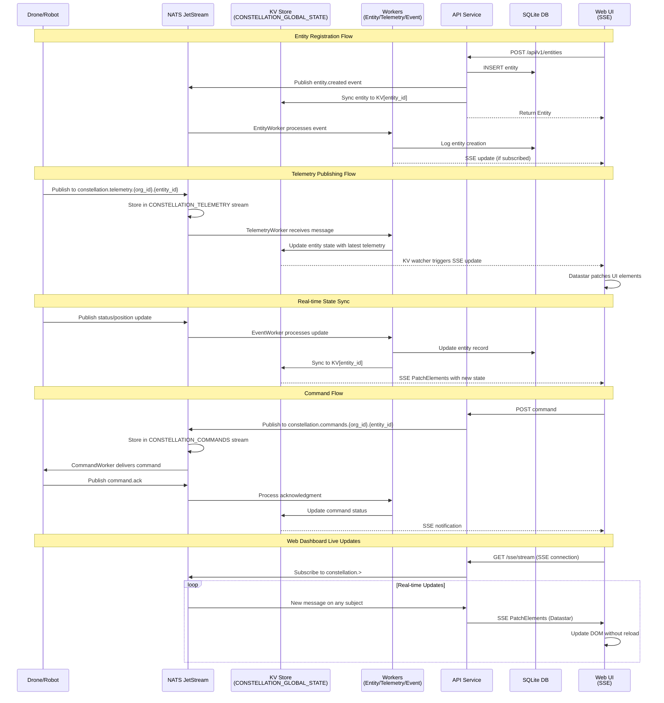

<p align="center">
  
  <h1 align="center">Constellation Overwatch</h1>
</p>

<p align="center">
  Open Source C4 for the Industrial Edge — Data Fabric & Toolbelt for Agentic Drones, Robots, Sensors, and Video Streams
</p>

<p align="center">
  <a title="Release" target="_blank" href="https://github.com/Constellation-Overwatch/constellation-overwatch/actions/workflows/release.yml"></a>
  <a title="Go Report Card" target="_blank" href="https://goreportcard.com/report/github.com/Constellation-Overwatch/constellation-overwatch"></a>
  <a title="Go Version" target="_blank" href="https://go.dev/"></a>
  <a title="License" target="_blank" href="https://github.com/Constellation-Overwatch/constellation-overwatch/blob/main/LICENSE"></a>
  <br>
  <a title="GitHub Pull Requests" target="_blank" href="https://github.com/Constellation-Overwatch/constellation-overwatch/pulls"></a>
  <a title="GitHub Commits" target="_blank" href="https://github.com/Constellation-Overwatch/constellation-overwatch/commits/main"></a>
  <a title="Last Commit" target="_blank" href="https://github.com/Constellation-Overwatch/constellation-overwatch/commits/main"></a>
</p>

---

## About

Constellation Overwatch is a rapid response industrial data stack designed with ontological data primitives. Use `entity_id` to stream real-time signal trees for vendor agnostic swarm orchestration research and deployment. Built on NATS JetStream for reliable, low-latency messaging with atomic operations and durable streams.

> **⚠️ Warning:** This software is under active development. While functional, it may contain bugs and undergo breaking changes. Use caution with production deployments and ensure you have proper backups.

## Features and Roadmap

* **Real-time Pub/Sub Messaging** for low-latency communication between edge devices and control systems
* **Durable Event Streams** using NATS JetStream for reliable message delivery and persistence
* **Multi-Entity Fleet Support** for managing drones, robots, sensors, and other autonomous systems
* **RESTful API** with scoped API key authentication for secure HTTP access
* **Embedded NATS Server** providing self-contained messaging with no external dependencies
* **High-Frequency Telemetry** streaming with efficient handling of sensor data
* **Real-time Web Dashboard** powered by Server-Sent Events (SSE) and Datastar framework
* **Type-Safe Templates** using Templ for reactive Go-based web components
* **SQLite Database** with auto-initialization and schema management
* **Event-Driven Architecture** with workers for entities, commands, telemetry, and events
* **Interactive Maps** using MapLibre web components with global KV watcher
* **Prometheus Metrics** with NATS and worker collectors for observability
* **Terminal UI (TUI)** BubbleTea-based dashboard with real-time entity, log, and system panels
* **Video Streaming** via MediaMTX integration with WebRTC/HLS/RTMP playback
* **Self-Update** binary auto-update from GitHub releases via `--update` flag

The following features are on our current roadmap:

* **Embedded AI Assistant** Context aware private / local AI assistant
* **Background Mavlink Bidirectional Routing** for QGroundControl + TAK Support
* **TLS 1.3 Encryption** for enhanced NATS security
* **Kubernetes Deployment** manifests and Helm charts and maximum availability + durability
* **Edge Client SDKs** for Go, Python, and Rust
* **Various Autonomy and Service Support** for drones, robots, and other autonomous systems i.e VSLAM, Flight Loader, Mission Recap, etc - Needs further input

## Architecture

### API Service Diagram



### Data Flow Sequence Diagram



## Getting Started

Please see the [Quick Start Guide](#quick-start-examples) below for detailed usage examples.

<details>
<summary>📋 Prerequisites</summary>
<br>

* Go 1.24 or higher
* [Task](https://taskfile.dev/) - Task runner (optional, recommended)

</details>

<details>
<summary>⚡ Quick Start</summary>
<br>

Clone the repository and start the server:

```bash
# Clone the repository
git clone https://github.com/Constellation-Overwatch/constellation-overwatch.git
cd constellation-overwatch

# Install dependencies
go mod download

# Run in development mode (recommended)
task dev

# OR run directly
go run ./cmd/microlith/main.go
```

The server will start:

* **API Server & Web UI**: `http://localhost:8080`
* **Embedded NATS**: `nats://localhost:4222`

</details>

<details>
<summary>🛠️ Installation (Task Runner)</summary>
<br>

Install Task for enhanced development workflow:

```bash
# macOS
brew install go-task/tap/go-task

# Linux
sh -c "$(curl --location https://taskfile.dev/install.sh)" -- -d -b ~/.local/bin

# Windows (using Scoop)
scoop install task
```

</details>

<details>
<summary>🌐 Web Dashboard</summary>
<br>

Access the real-time web interface at `http://localhost:8080`

**Features:**

* View organizations and entities in real-time
* Monitor NATS streams and key-value stores
* Create and manage fleet entities
* Watch live telemetry data
* Interactive map with MapLibre
* Fleet table management
* Video streaming with WebRTC
* Prometheus metrics dashboard
* API documentation via Redoc

**Technology Stack:**

* **Templ** - Type-safe Go HTML templates
* **Datastar** - Hypermedia framework for reactive UI
* **Server-Sent Events (SSE)** - Real-time data streaming
* **MapLibre** - Interactive maps
* **MediaMTX** - Video streaming (WebRTC/HLS/RTMP)

**Development Mode:**

```bash
task dev  # Auto-rebuilds templ templates on changes
```

</details>

<details>
<summary>🐳 Docker Deployment</summary>
<br>

Build and run with Docker:

```bash
# Build image
task docker-build

# Run with Docker Compose
task docker-run

# Stop service
task docker-stop
```

</details>

### Configuration

Create a `.env` file in the project root (copy from `.env.example`):

```bash
cp .env.example .env
```

Configuration options:

* `PORT` - HTTP server port (default: `8080`)
* `OVERWATCH_DATA_DIR` - Root data directory; DB at `<dir>/db/constellation.db`, NATS at `<dir>/overwatch/` (default: `./data`)
* `NATS_PORT` - NATS server port (default: `4222`)

See `.env.example` for the full list including production overrides.

### Authentication

* **Web UI** - WebAuthn passkey authentication. On first run an admin user is bootstrapped and a registration link is printed to the console.
* **REST API** - API keys with the `c4_live_` / `c4_test_` prefix, passed via `X-API-Key` header or `Authorization: Bearer c4_live_...`.
* **NATS** - NKey-based authentication for edge devices.

```bash
curl -H "X-API-Key: c4_live_..." http://localhost:8080/api/v1/organizations
```

## Quick Start Examples

<details>
<summary>🚀 API Quickstart with curl</summary>
<br>

Once the server is running, provision an organization and create entities:

**Step 1: Set your API key**

```bash
export API_KEY="c4_live_..."  # generate via Web UI → Settings → API Keys
```

**Step 2: Create an organization**

```bash
curl -s -X POST http://localhost:8080/api/v1/organizations \
  -H "X-API-Key: $API_KEY" \
  -H "Content-Type: application/json" \
  -d '{
    "name": "My Fleet",
    "org_type": "civilian",
    "description": "Test drone fleet"
  }'
```

**Allowed `org_type` values:** `military`, `civilian`, `commercial`, `ngo`

**Example Response:**

```json
{
  "success": true,
  "data": {
    "org_id": "ae9c65d0-b5f3-4cec-8ffa-68ff1173e050",
    "name": "My Fleet",
    "org_type": "civilian",
    "metadata": "{}",
    "created_at": "2025-10-22T11:34:29.195678-05:00",
    "updated_at": "2025-10-22T11:34:29.195678-05:00"
  }
}
```

**Step 3: Register entities to the organization**

Extract the `org_id` from the response above:

```sh
export ORG_ID='ae9c65d0-b5f3-4cec-8ffa-68ff1173e050'
curl -s -X POST "http://localhost:8080/api/v1/entities?org_id=$ORG_ID" \
  -H "X-API-Key: $API_KEY" \
  -H "Content-Type: application/json" \
  -d '{
    "name": "Drone-001",
    "entity_type": "aircraft_multirotor",
    "description": "Primary vegetation inspection drone",
    "metadata": {
      "model": "DJI-M300",
      "serial": "ABC123456"
    }
  }'
```

**Example Response:**

```json
{
  "success": true,
  "data": {
    "entity_id": "5458eec0-b0e3-4290-8db5-17936dbbfc64",
    "org_id": "ae9c65d0-b5f3-4cec-8ffa-68ff1173e050",
    "entity_type": "aircraft_multirotor",
    "status": "unknown",
    "priority": "normal",
    "is_live": false
  }
}
```

**Step 4: Query and manage entities**

```bash
# Extract entity_id from response
export ENTITY_ID='5458eec0-b0e3-4290-8db5-17936dbbfc64'

# List all entities in organization
curl -s "http://localhost:8080/api/v1/entities?org_id=$ORG_ID" \
  -H "X-API-Key: $API_KEY" | jq

# Get specific entity details
curl -s "http://localhost:8080/api/v1/entities?org_id=$ORG_ID&entity_id=$ENTITY_ID" \
  -H "X-API-Key: $API_KEY" | jq

# Update entity status
curl -s -X PUT "http://localhost:8080/api/v1/entities?org_id=$ORG_ID&entity_id=$ENTITY_ID" \
  -H "X-API-Key: $API_KEY" \
  -H "Content-Type: application/json" \
  -d '{
    "status": "active",
    "metadata": {
      "location": "lat:37.7749,lon:-122.4194",
      "battery": "85%"
    }
  }' | jq
```

</details>

## API Endpoints

### Organizations

* `POST /api/v1/organizations` - Create organization

* `GET /api/v1/organizations` - List organizations
* `GET /api/v1/organizations?org_id=xxx` - Get organization

### Entities

* `POST /api/v1/entities?org_id=xxx` - Create entity

* `GET /api/v1/entities?org_id=xxx` - List entities
* `GET /api/v1/entities?org_id=xxx&entity_id=yyy` - Get entity
* `PUT /api/v1/entities?org_id=xxx&entity_id=yyy` - Update entity
* `DELETE /api/v1/entities?org_id=xxx&entity_id=yyy` - Delete entity

### Video (via MediaMTX)

Video streaming is handled by [MediaMTX](https://github.com/bluenviron/mediamtx) when configured. The web UI queries stream status via internal endpoints:

* `GET /api/video/list` - List available streams (web UI)
* `GET /api/video/status` - Stream status (web UI)

WebRTC/HLS/RTMP playback is served directly by MediaMTX.

### Monitoring

* `GET /health` - Service health status
* `GET /api/v1/sys/monitor/sse` - System monitor SSE stream

## NATS Subjects

### Entity Events

* `constellation.entities.{org_id}.created`

* `constellation.entities.{org_id}.updated`
* `constellation.entities.{org_id}.deleted`
* `constellation.entities.{org_id}.status`

### Telemetry

* `constellation.telemetry.{org_id}.{entity_id}`

### Commands

* `constellation.commands.{org_id}.{entity_id}`

* `constellation.commands.{org_id}.broadcast`

## Project Structure

```
constellation-overwatch/
├── cmd/
│   └── microlith/              # Main application entry point
├── api/
│   ├── handlers/               # API handlers (health, orgs, entities, monitor)
│   ├── middleware/             # HTTP middleware (auth, CORS)
│   ├── responses/             # JSON response helpers
│   ├── services/               # Business logic (entities, organizations, API keys, auth)
│   └── router.go               # API router definition
├── db/
│   ├── service.go              # Database service with auto-initialization
│   └── schema.sql              # SQLite database schema
├── pkg/
│   ├── metrics/                # Prometheus metrics (collectors, registry, pprof)
│   ├── ontology/               # Core domain models and entity types
│   ├── shared/                 # Shared types, constants, and NATS subjects
│   ├── tui/                    # Terminal UI dashboard (BubbleTea)
│   │   ├── datasource/        # Data sources (entities, logs, metrics, NATS, workers)
│   │   ├── panels/            # Dashboard panels (entities, logs, system, workers)
│   │   └── styles/            # Terminal styling
│   ├── updater/                # Binary self-update from GitHub releases
│   └── services/
│       ├── embedded-nats/      # Embedded NATS JetStream server
│       ├── logger/             # Centralized logging service (Zap)
│       ├── mediamtx/           # MediaMTX video integration client
│       ├── workers/            # Background event processors (entity, command, telemetry, event)
│       └── web/                # Web UI and SSE services
│           ├── components/     # Reusable Templ UI components (badge, button, card, etc.)
│           ├── datastar/       # Datastar framework integration
│           ├── features/       # Feature-based pages
│           │   ├── admin/     # User, API key, and invite management
│           │   ├── auth/      # Passkey login and registration
│           │   ├── common/    # Shared layouts, navigation, entity card
│           │   ├── fleet/     # Fleet management table
│           │   ├── map/       # Interactive MapLibre map
│           │   ├── metrics/   # Metrics dashboard
│           │   ├── organizations/ # Org and entity management
│           │   ├── overwatch/ # Main dashboard with analytics
│           │   ├── streams/   # NATS streams viewer
│           │   └── video/     # Video streaming page
│           ├── handlers/       # Web page handlers (admin, auth, map, video, metrics, etc.)
│           ├── signals/        # Web component signal types
│           ├── static/         # Static assets (CSS, JS, images)
│           ├── router.go       # Web router and API mounting
│           ├── server.go       # HTTP server lifecycle
│           └── sse_handler.go  # Server-Sent Events handler
├── prd/
│   └── design/                 # Product requirements and design docs
│       ├── IMPLEMENTATION_PLAN_DETAILED.md  # Protobuf/gRPC implementation plan
│       ├── IMPLEMENTATION_PLAN_PART2-4.md   # Client SDK implementation phases
│       └── UNIFIED_CLIENT_ARCHITECTURE.md   # Unified client SDK architecture
├── tests/
│   └── publish-simulations/    # NATS publish simulation scripts
├── bin/                        # Compiled binaries (auto-generated)
├── data/                       # NATS JetStream data + SQLite DB (auto-generated)
├── logs/                       # Application logs (auto-generated)
└── nats.conf                   # NATS server configuration
```

## Updating

Update to the latest version with a single command:

```bash
overwatch --update
```

This will:
1. Check GitHub for the latest release
2. Download the appropriate binary for your platform
3. Replace the current binary with the new version

## Development

<details>
<summary>🔨 Building and Running</summary>
<br>

```bash
# Development mode (auto-rebuild templ templates)
task dev

# Generate templ templates
task templ-generate

# Watch templ files for changes
task templ-watch

# Build the binary
task build
# OR manually: go build -o bin/overwatch ./cmd/microlith

# Run the binary
task run
# OR manually: ./bin/overwatch

# Run tests
go test ./...

# Format code
go fmt ./...

# Run go vet
go vet ./...

# List all available tasks
task --list
```

</details>

## Security

<details>
<summary>🔒 Authentication</summary>
<br>

**REST API:** Use API keys (generated via Web UI or admin bootstrap):
```bash
curl -H "X-API-Key: c4_live_..." http://localhost:8080/api/v1/organizations
```

**Web UI:** WebAuthn passkey authentication. On first run, a registration link is printed to the console.

**NATS Edge Devices:** NKey-based authentication, managed via the API.

</details>

<details>
<summary>🔐 TLS Encryption</summary>
<br>

Enable TLS 1.3 for NATS connections:

**Step 1: Generate certificates (development)**

```bash
task generate-certs
```

**Step 2: Configure environment variables**

```bash
NATS_TLS_ENABLED=true
NATS_TLS_CERT=/path/to/server.crt
NATS_TLS_KEY=/path/to/server.key
```

</details>

## Contributing

We welcome contributions to Constellation Overwatch! Please check out our [contribution guidelines](CONTRIBUTING.md) to get started.

### How to Contribute

1. Fork the repository
2. Create a feature branch (`git checkout -b feature/amazing-feature`)
3. Commit your changes (`git commit -m 'Add amazing feature'`)
4. Push to the branch (`git push origin feature/amazing-feature`)
5. Open a Pull Request

### Development Guidelines

* Follow Go best practices and conventions
* Add tests for new features
* Update documentation as needed
* Run `go fmt ./...` and `go vet ./...` before committing
* Ensure all tests pass with `go test ./...`

## License

This project is licensed under the [MIT License](LICENSE).

### Contribution

Unless you explicitly state otherwise, any contribution intentionally submitted for inclusion in Constellation Overwatch by you shall be licensed as MIT, without any additional terms or conditions.
